# foosball

## Live Draft Tools: Setup Guide (for friends hosting their own copy)

`nflDraftDashboard.py` (browser dashboard) + a Chrome extension for a pinned side panel next to your Sleeper draft tab. Polls a Sleeper draft and recommends picks in real time. Runs entirely on your own machine — nothing uploaded anywhere.

### 1. Prerequisites

1. Install Python from [python.org](https://www.python.org/downloads/) (Windows/Mac installer, defaults are fine). On Windows, check "Add Python to PATH."
2. Download this repo: GitHub → green "Code" button → "Download ZIP" → unzip.
3. Open a terminal in the unzipped folder:
   - **Windows**: File Explorer → address bar → type `cmd` → Enter.
   - **Mac**: Terminal → `cd ` (with trailing space) → drag the folder in → Enter.
4. Install dependencies:
   ```
   pip install pandas numpy requests plotly dash
   ```
That's it — `vorp_2026.csv` and the other data files the dashboard reads ship pre-built inside the repo download itself, so there's nothing else to fetch or ask James for.

### 2. Start the dashboard + install the extension

**Start the dashboard** (no draft ID/slot needed at launch):
```
python python/nflDraftDashboard.py --port 8877
```
The app starts blank and stays running across every mock draft. Leave the terminal open; closing it stops the dashboard.

**Install the extension (one-time):**
1. Chrome → `chrome://extensions` → enable **Developer mode** (top right).
2. **Load unpacked** → select `chrome-extension/live-draft-sidepanel` inside your unzipped repo.
3. Click the extension's toolbar icon — opens a pinned side panel next to any tab, including your Sleeper draft.
4. In the panel's top bar, enter `http://127.0.0.1:8877` and click **Save**. This persists across restarts.

**Each draft:**
1. In the dashboard (side panel or `http://127.0.0.1:8877` in a full tab), paste your draft ID/URL and slot into the **Load Draft** bar at the top of the page.
2. Click **Load Draft**.
3. To switch to a new mock, paste the new draft ID/slot and click **Load Draft** again — no restart required.

(You can still pass `<draft_id> <my_slot>` as CLI args at launch if you prefer — see `--help` — but they're optional; the in-page bar is the normal flow.)

**Running the dashboard on a different machine than your browser** (e.g. hosting on a home server, viewing from a laptop): start it with `--host 0.0.0.0` instead of the default `127.0.0.1`, then use that machine's LAN IP (e.g. `http://10.0.0.x:8877`) in the extension's URL bar instead of `127.0.0.1`. Only do this on a trusted home network — `0.0.0.0` accepts connections from any device that can reach that IP.

### 3. Find your draft ID and slot

- **Draft ID**: open your Sleeper draft, copy the number from the URL — `https://sleeper.com/draft/nfl/`**`1234567890123456789`**.
- **Slot**: your pick position in round 1 (e.g. pick 5th → slot `5`).

### Troubleshooting

| Symptom | Fix |
|---|---|
| `command not found: python` | Use `python3` instead of `python`. |
| `error: draft_id and my_slot must be given together, or both omitted` | You passed one CLI arg but not the other — pass both, or neither and use the Load Draft bar instead. |
| Stuck at "Draft not started yet" | Draft hasn't begun on Sleeper's end, or wrong draft ID — recheck the URL. |
| `ModuleNotFoundError` | Re-run the `pip install` command from step 1.4. |
| Extension side panel says "refused to connect" | Dashboard isn't running, or the URL in the panel doesn't match where it's actually listening (`127.0.0.1` vs a LAN IP — see above). |
| Red banner: "vorp_2026.csv is missing/broken" | Shouldn't happen on a fresh clone (the file ships in the repo) — if you deleted/moved it, re-download the repo or restore `outputs/fantasy/vorp_2026.csv`. |

---

NFL/fantasy football data tools. Two independent parts:
1. Standalone NFL analytics plots (R).
2. Fantasy "moneyball" pipeline for Room 40 (Python + R): VORP/ADP draft prep, projections, live draft tools.

Repo assumed cloned to `~/foosball`. Outputs write to `outputs/`, trained models to `models/`.

---

## Setup

**R**: tidyverse, nflreadr, nflfastR, ggplot2, patchwork, plotly, fflr, ggimage, ggthemes, httr, rvest, wdman, tidytext, jsonlite (per-script, see each file's `library()` calls).

**Python**: pandas, numpy, scipy, scikit-learn, lightgbm, matplotlib, plotly, dash, requests, joblib.

---

## NFL Analytics (R, standalone)

Independent of the fantasy pipeline. Each script fetches its own data.

| Script | Output | Metric |
|---|---|---|
| `r/epaMap.R` | 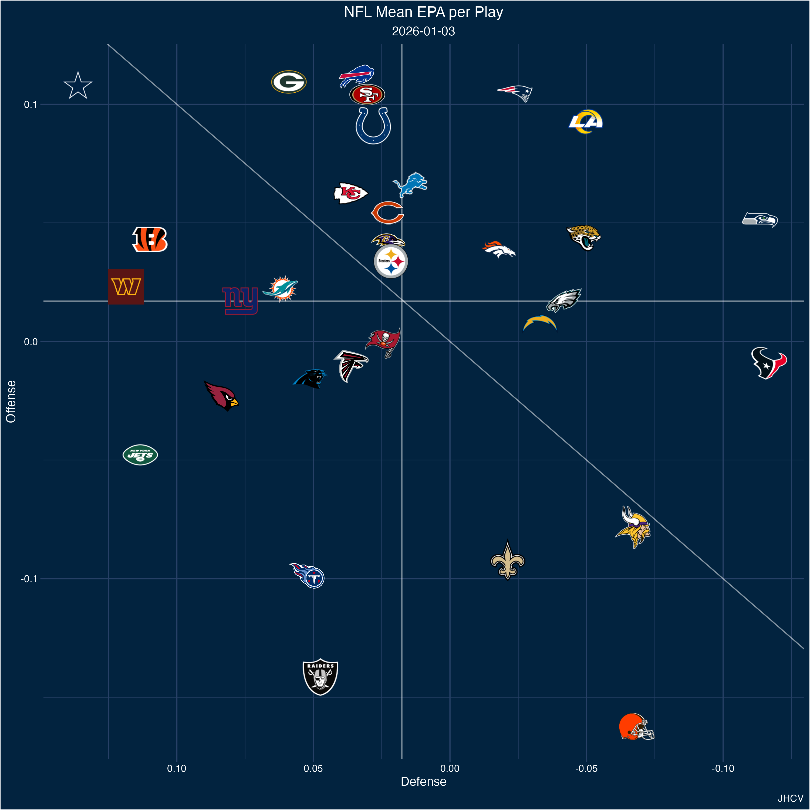 | Offense EPA/play vs defense EPA/play, full season. Top-right = good on both sides of the ball. |
| `r/nflQbStats.R` | 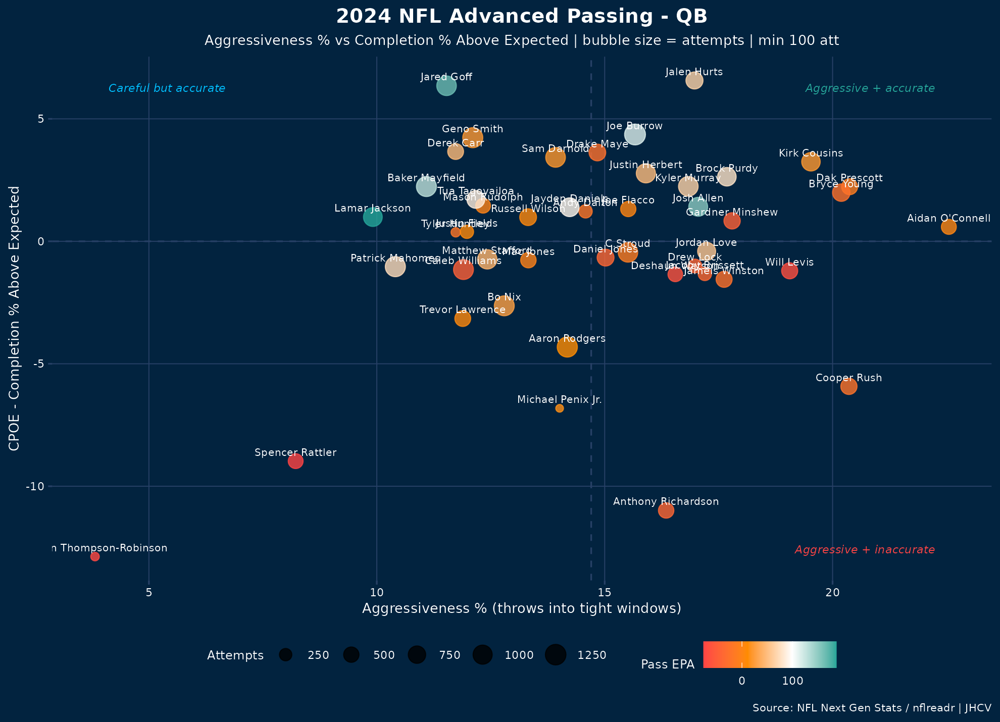 | CPOE vs aggressiveness. Top-right = accurate + aggressive. |
| `r/nflRbStats.R` | 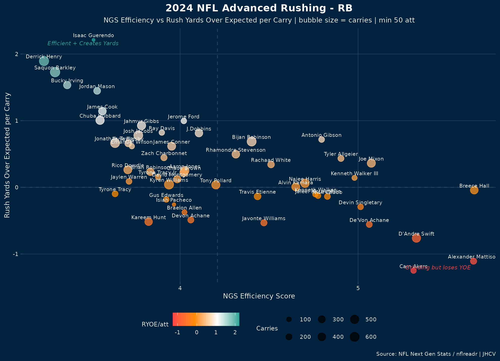 | Rush yards over expected (NGS), isolates back's contribution from O-line. |
| `r/nflWrStats.R` | 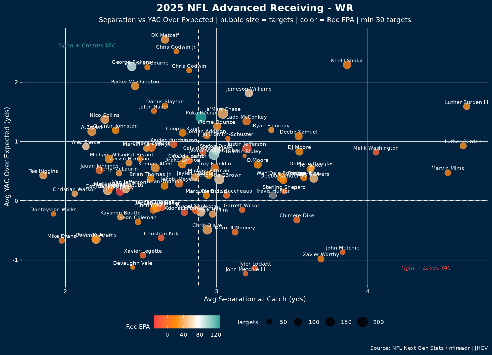 | Separation, YAC over expected, target share. Route-running skill vs volume. |
| `r/nflTeStats.R` | 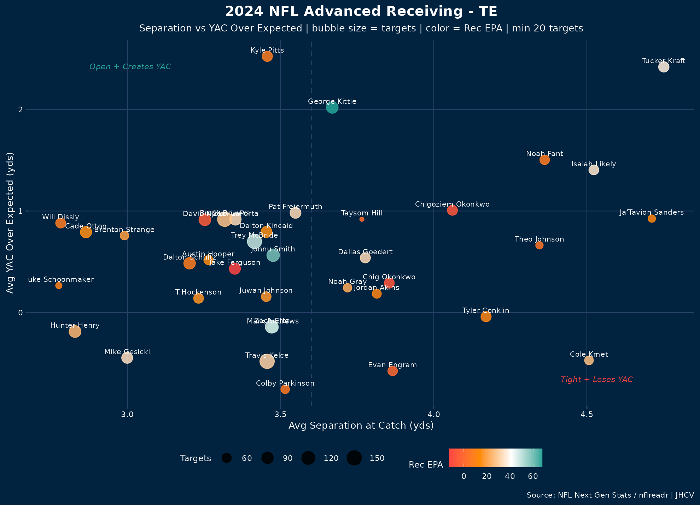 | Same as WR stats, TE-specific baseline. |
| `r/nflOlStats.R` | 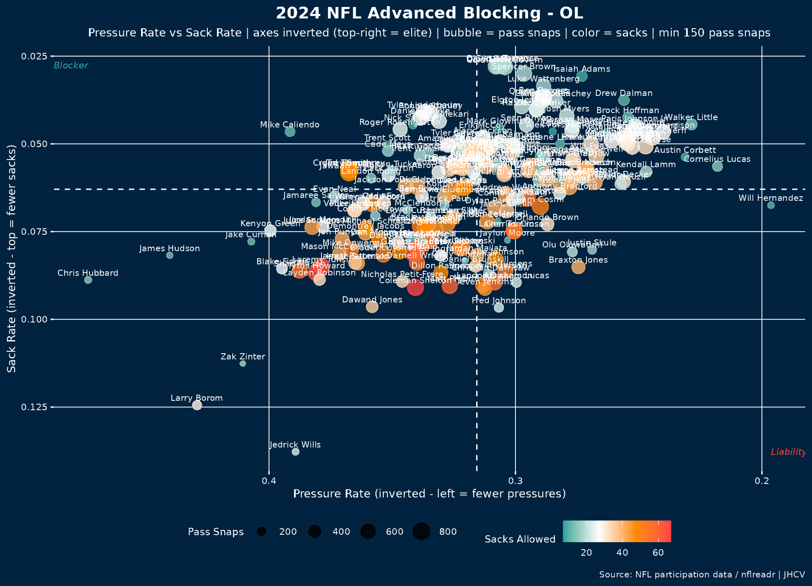 | Pressure rate vs sack rate, pass-block reps only. Bottom-left = best. |
| `r/room40map.R` | 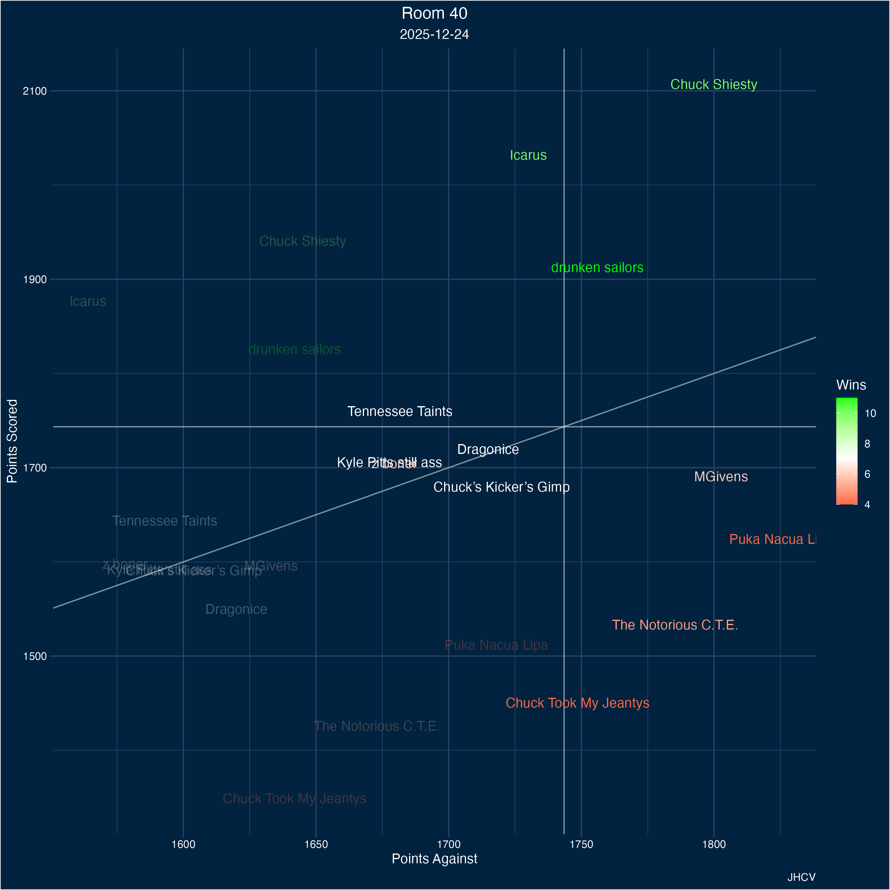 | Live Room 40 standings/roster viz, Sleeper API (league `1259616442014244864`). |
| `r/targetShare.R` | 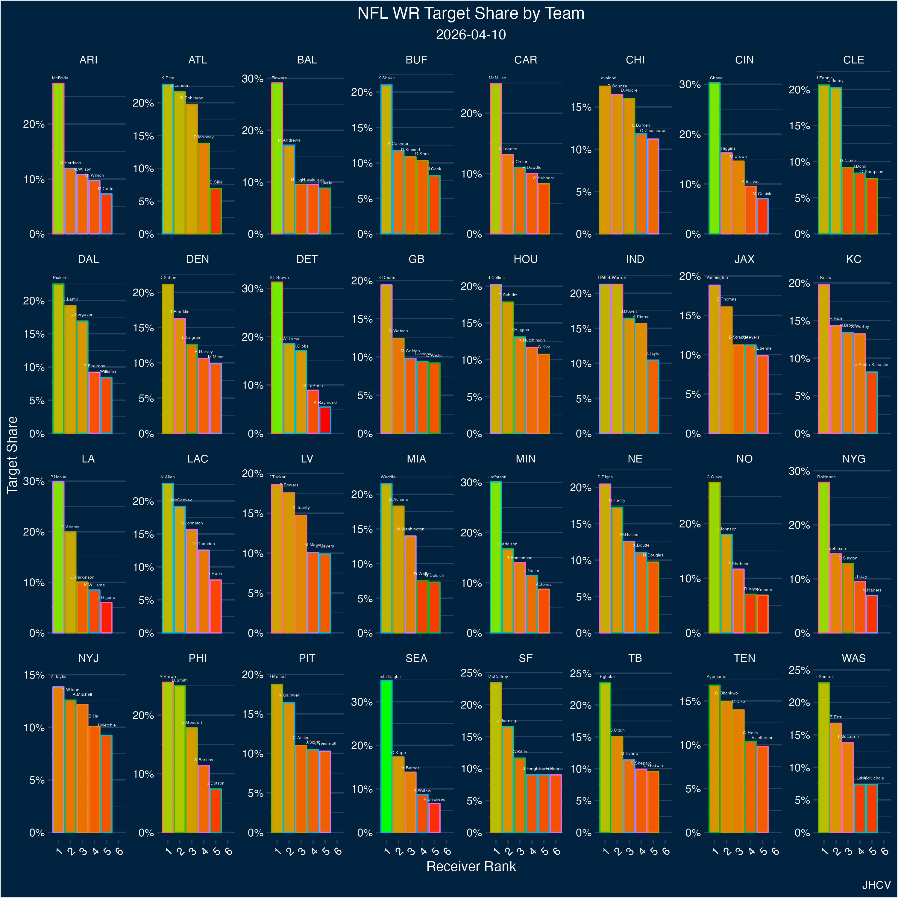 | Target share by player/team, full-season play-by-play. |
| `r/scorekeepe.R` | 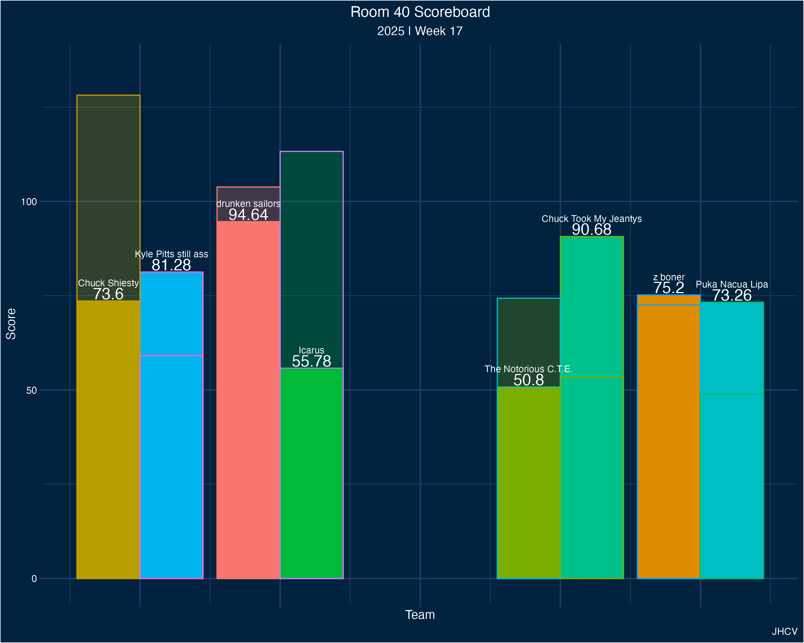 | Weekly Room 40 scoreboard. Reads `outputs/sleeper_proj_pts.csv`, `outputs/players.json`. |
| `r/nflPlaye.R` | — | Utility: Sleeper NFL player directory → `outputs/players.json`. Feeds `room40map.R`, `scorekeepe.R`. |
| `r/nextNFL.R` | — | Utility: next scheduled NFL game, countdown. No plot. |

---

## Fantasy Moneyball Pipeline

Room 40 settings: 12 teams, full PPR, QB/RB/RB/WR/WR/TE/FLEX/K/DEF/BN x5, no keepers.

Objective: rank draft value from data, not gut feel. VORP over raw projections, empirical league splits over assumed ones, leakage-safe time-based train/val splits (same standard as the SPY trading model).

Phases run in order; each depends on the prior phase's output files. **This section documents James's own pipeline for his reference — if you're a friend just setting up the live draft dashboard, you don't need any of this; jump to "Live Draft Tools: Setup Guide" above instead. Running Phase 1 yourself means pulling 27 seasons of nflverse play-by-play from scratch (`fetchNflCareerData.R` → `career_panel.csv`), which is not needed for the dashboard/extension.**

### Phase 1: Feature building (R)

| Script | Output | Function |
|---|---|---|
| `r/fetchNflCareerData.R` | `outputs/fantasy/career_panel.csv` | Player-season panel, Room 40 scoring rules applied to nflverse stats. |
| `r/fetchNflSnapShare.R` | — | Snap share + target share per player-season. Separates starter volume from name-value backup. |
| `r/fetchNflSchemeFeatures.R` | — | Team-season play-calling tendency (pass rate over expected, pace). |
| `r/mergeNflCoachingStaff.R` | — | Coaching staff history, team/season table. |
| `r/buildNflCoachSignature.R` | — | Coach-level scheme signature, persists across team changes (no reset to league-average on a coordinator hire). |
| `r/mergeNflPhase1Features.R` | — | Joins usage features + coach signature → complete Phase 1 table. |
| `r/nflPhase1Diagnostics.R` | 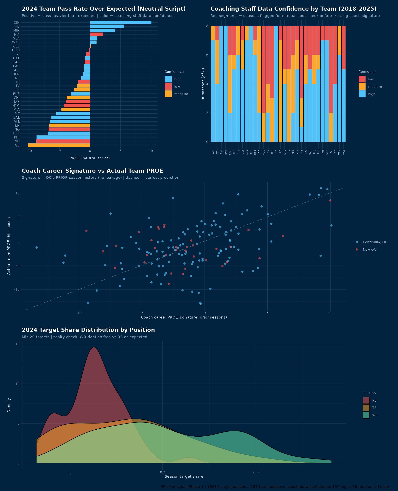 | 4-panel sanity check before modeling. |

### Phase 2: Projection model (Python + R)

| Script | Output | Function |
|---|---|---|
| `python/trainNflFantasyModel.py` | — | Season-long fantasy point model, Ridge + LightGBM per position. Time-based train/val split (never random — this is a time series). |
| `python/buildNflFlexSplit.py` | — | Empirical FLEX allocation (RB/WR/TE) from actual scoring history. Room 40 result: ~95% WR / 5% RB / 0% TE, full PPR. Replaces a stale hardcoded assumption. |
| `r/nflPhase2Diagnostics.R` | 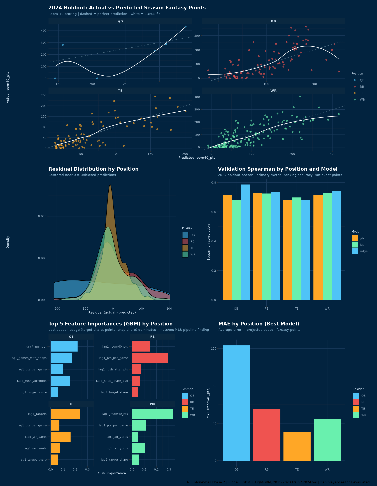 | 5-panel model diagnostic: actual vs predicted by position, residuals, feature importance, Spearman, MAE by position. |
| `python/buildNflAgingCurve.py` | 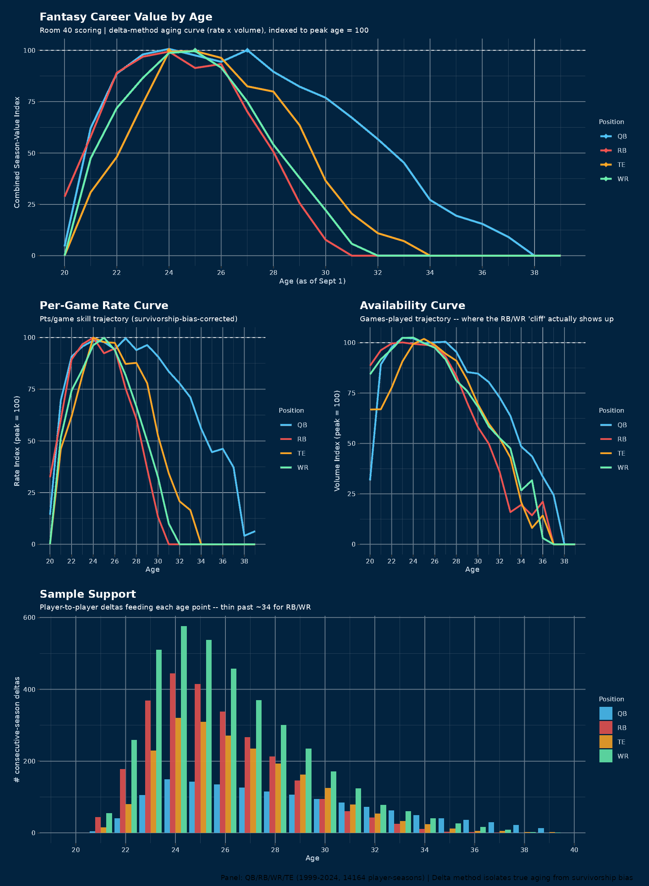 | Position-specific aging curves, delta method (tracks each player's own YoY change; avoids survivorship bias vs cross-sectional averaging). |

### Phase 3: 2026 projections + VORP (Python)

| Script | Output | Function |
|---|---|---|
| `python/fetchNflAdpAndRoster.py` | — | Current ADP from Sleeper. |
| `python/buildNfl2026Projections.py` | — | Applies Phase 2 model to every ADP'd player, using real 2025 usage as input. |
| `python/buildNflVorp.py` | `outputs/fantasy/vorp_2026.csv` | Core moneyball layer: projections → Value Over Replacement Player (Room 40 roster math + empirical FLEX split), joined to ADP to surface market inefficiencies. |
| `r/nflPhase3Diagnostics.R` | 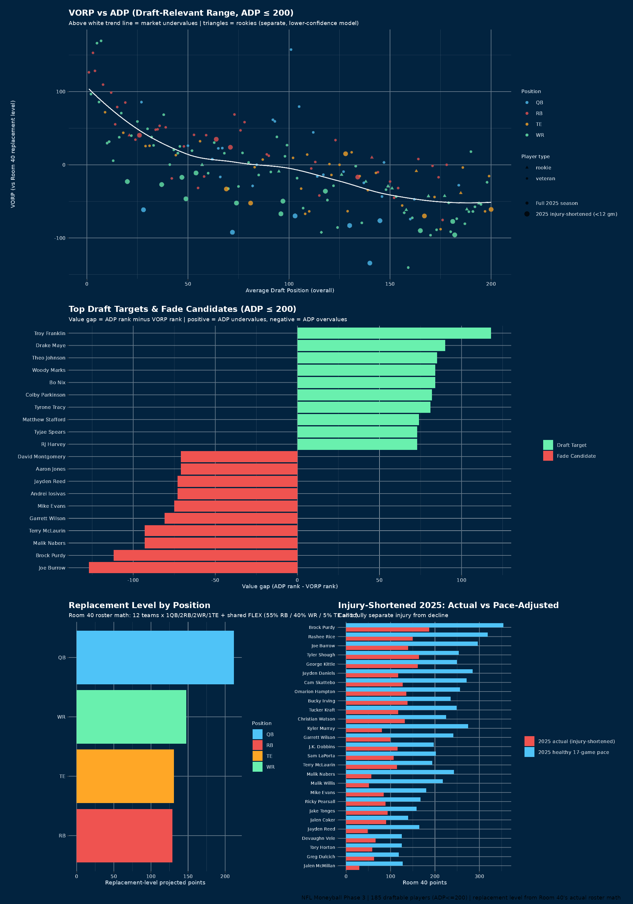 | 4-panel check on the VORP/ADP layer. |

### Phase 4: Draft day tools (Python)

| Script | Output | Function |
|---|---|---|
| `python/buildNflDraftBoard.py` | 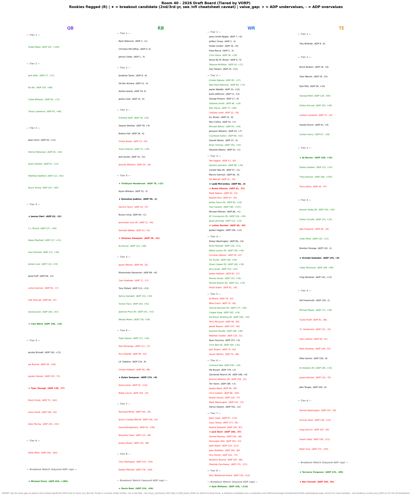 | Tiered cheat sheet, one column per position. Tiers from 1D KMeans on VORP (real value gaps, not arbitrary round cutoffs). Breakout candidates starred. |
| `python/buildNflBigBoard.py` | 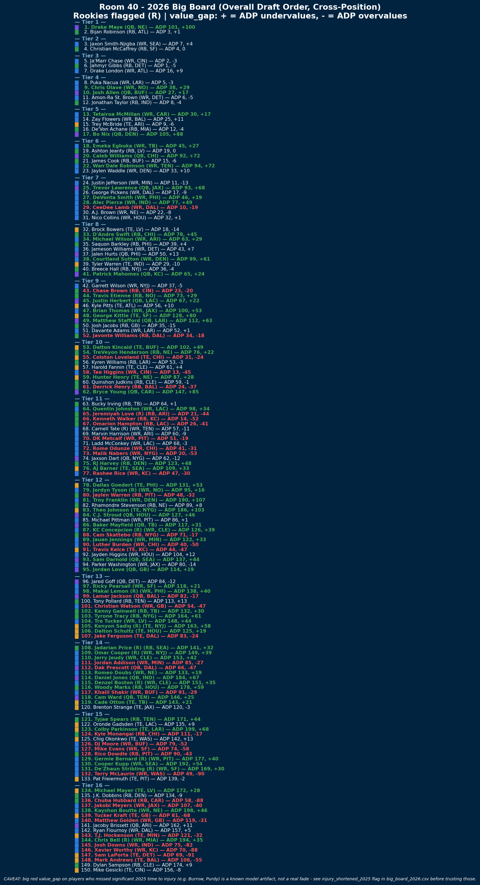 | Same data, flattened to one position-agnostic ranked list. |
| `python/nflDraftLive.py` | — | Tracks drafted players during a live draft; board shows best-available. JSON state file, no UI. |
| `python/buildNflPositionalScarcity.py` | 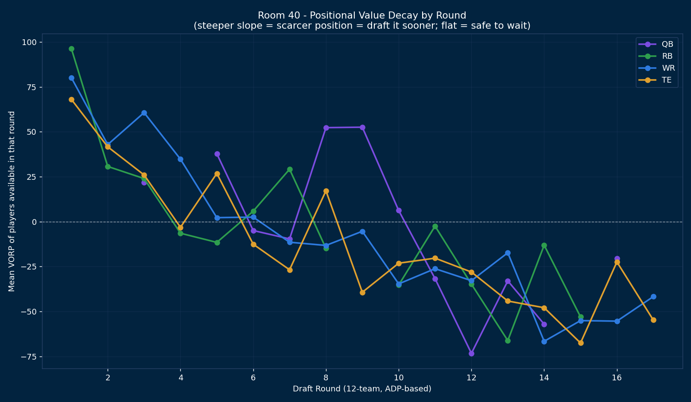 | Round-by-round value cliff by position. Steep drop = scarce, reach now; flat = safe to wait. |
| `python/buildNflDraftStrategySim.py` | 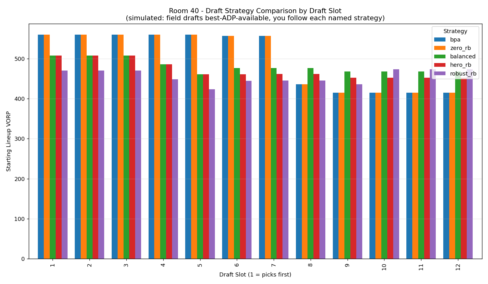 | Simulates 12-team snake drafts under named strategies (zero RB, hero RB, robust RB, balanced, BPA). Scores by resulting STARTING LINEUP VORP, not total value drafted. |
| `python/buildNflStrategyGuide.py` | 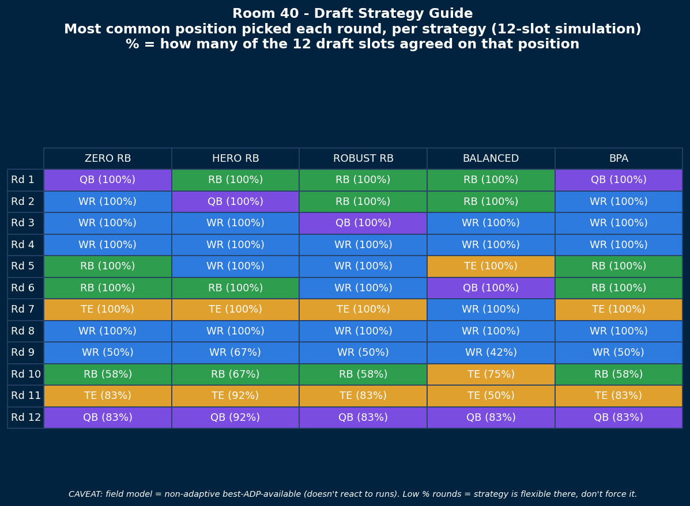 | Strategy sim → round-by-round printable card. |
| `python/nflMockDraftLog.py` | — | Grades a completed Sleeper mock against the VORP board; logs for cross-mock comparison. |
| `python/nflDraftWatch.py` | — | Live CLI draft assistant. Polls a Sleeper draft, prints pick recommendations ranked by marginal starting-lineup VORP gain after every pick. |
| `python/nflDraftDashboard.py` | 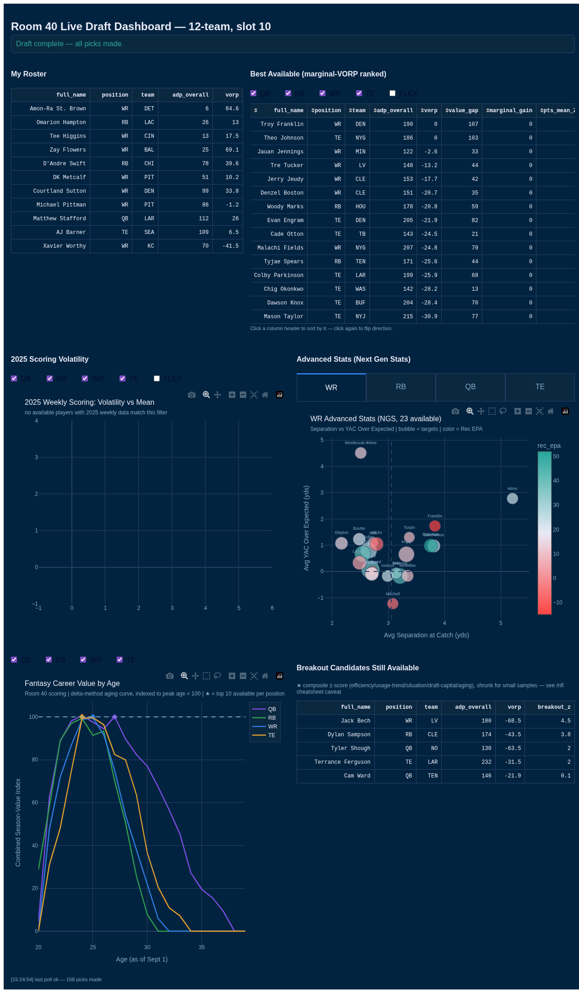 | Browser UI (Dash/Plotly) on the same recommendation engine as the CLI watcher. Runs on your own machine alongside the Sleeper tab. Supports switching drafts live via an in-page URL input — no restart between mocks. Pairable with the Chrome extension in `chrome-extension/` (see setup guide above). |

### Phase 5: Breakout candidates + rookies (Python + R)

| Script | Output | Function |
|---|---|---|
| `r/fetchNflBreakoutSignals.R` | — | Raw signal inputs (efficiency, usage trend) for 2nd/3rd-year breakout scoring. |
| `python/buildNflBreakoutScore.py` | — | Composite z-scored breakout score for young skill players — strong underlying signal, production hasn't caught up yet. |
| `r/fetchNflRookieData.R` | — | Draft capital + combine testing, rookies with no NFL usage history. |
| `python/buildNflRookieLandingSpot.py` | — | Vacated target/snap share on a rookie's new team — clear path to touches, independent of talent. |
| `python/buildNflRookieTrainingPanel.py` / `python/trainNflRookieModel.py` | — | Small-sample rookie-year model (Ridge only): draft capital + combine + landing spot. No prior-year usage available for the main model. |
| `python/scoreNfl2026Rookies.py` | — | Scores the incoming rookie class with the rookie prior model. |

---

## Notes

- `outputs/` mostly populates on first run and is gitignored, EXCEPT the pre-built data files the live-draft dashboard needs (`vorp_2026.csv`, `draft_board_2026.csv`, ADP spread/volatility, 2025 weekly scoring volatility, aging curves, breakout candidates, NGS exports, ~1.1MB total) — those are committed so a fresh clone works immediately with every context column populated, no manual file hand-off required.
- `models/` ships pretrained (16 `.pkl` files, ~2MB) — draft-day tools work out of the box, no retraining required.
- Live draft tools (`nflDraftWatch.py`, `nflDraftDashboard.py`, `nflDraftLive.py`) require a real or mock Sleeper draft ID.
- All plots use a dark navy theme (`#02233F` / `#1c2e4a`) for consistency across the repo.
